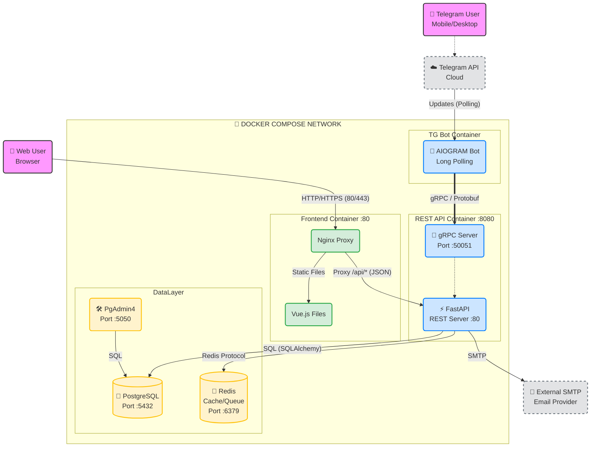

# QR Bill App

This project is a full-stack application for generating and managing bills with QR codes. It consists of a FastAPI backend, a web-based frontend, and all the necessary configurations for deployment.

## Table of Contents

- [Project Structure](#project-structure)
- [Getting Started](#getting-started)
- [Backend](backend/README.md)
- [Frontend](frontend/README.md)
- [Deployment](deployment/README.md)

## Project Structure

The project is organized into the following directories:

- **backend:** Contains the FastAPI application, including the API, database models, and business logic.
- **frontend:** Contains the web-based frontend, built with a modern JavaScript framework.
- **deployment:** Contains Docker files and other configurations for deploying the application.
- **scripts:** Contains various scripts for managing the project, such as database migrations and tests.
- **email_templates:** Contains templates for emails sent by the application.
- **openapi:** Contains the OpenAPI specification for the backend API.
- **ubuntu_system:** Contains system-level configurations for the Ubuntu server.

## Architecture diagram of the project

## Getting Started

To get started with the project, you'll need to have Docker and Docker Compose installed. Then, you can run the following command to start the application:

`docker-compose up -d`

This will start the backend, frontend, and all the necessary services. You can then access the frontend at `http://localhost:3000` and the backend at `http://localhost:8000`.
