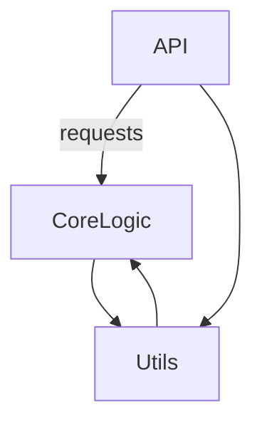

# Architecture Overview

This document provides a high-level view of the systems architecture highlighting the main components and their interactions.

## System Components

- **Core Logic:** Contains the primary business rules and processing logic.
- **API Layer:** Exposes functionality via RESTful or other API endpoints.
- **Utilities:** Helper functions and reusable components.

## Component Interaction Diagram

## Data Flow

1. Incoming requests enter through API layer.
2. API layer delegates processing to the core logic.
3. Core logic calls utility modules as needed.
4. Processed results return to API layer.
5. API responses are sent back to the requester.

